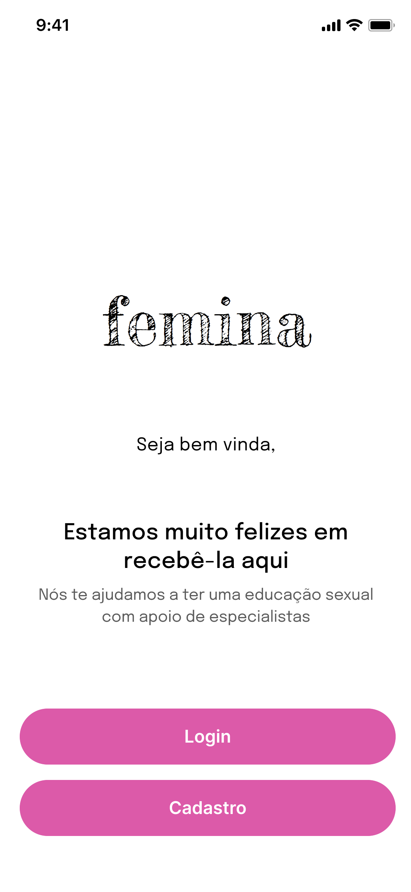
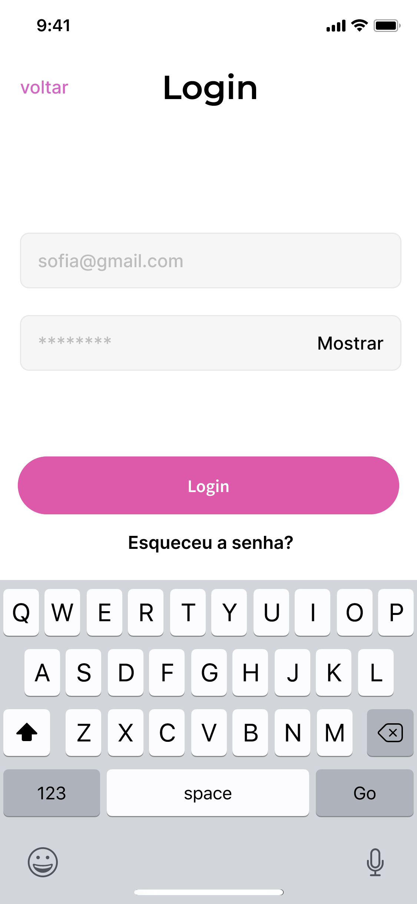
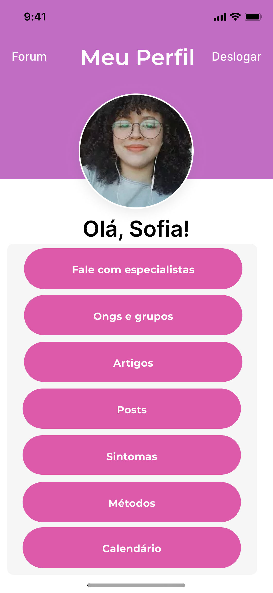
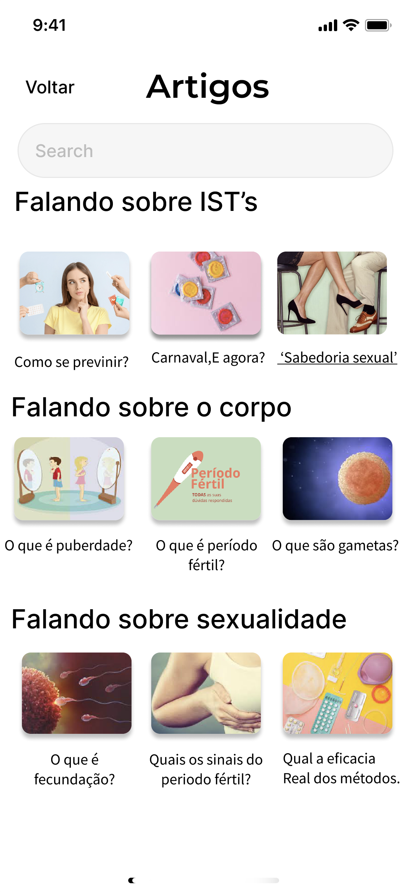

# Projeto Femina

 

# Sobre o projeto

https://www.figma.com/proto/4Z5SYIYOVyyJ6LaNNfZRRZ/Projeto-integrador---Grupo-6?type=design&node-id=170-1172&t=j8ORmvnqWKrAuOhk-1&scaling=scale-down&page-id=0%3A1&starting-point-node-id=170%3A1172&mode=design

O projeto Femina é uma aplicativo possui o objetivo principal de disseminar a educação sexual e, consequentemente, gerar conscientização  acerca do tema. 

## Funcionalidades do aplicativo

-Área de cadastro/login 

-Área expositiva com artigos e videos

-Fórum de  perguntas e respostas 

-Setor com contato de ONGs 

-Calendário menstrual

-Chat com especialistas 

-Localizador de clínicas perto do usuário ;

## Layout 
   
  

# Autores

Lucas carneiro de lima, Ana Cecília Simões Chalegre, Arthur Marques, Hallan Victor Pereira de Almeida, Rodrigo Argolo Carvalho Miranda, Salmo Thélio de Souza, Victor Costa Medeiros.

https://www.linkedin.com/in/lucas-carneiro-790500262/

 
